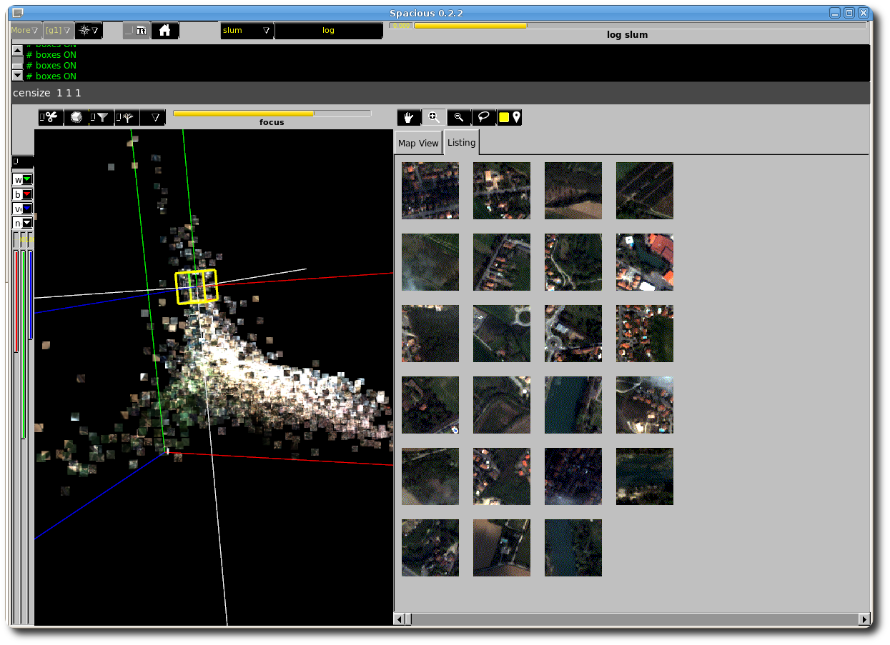

# spacious
This piece is developed based on the open source project [PartiView](https://github.com/embeepea/partiview) which was originally used for visualizing astronomical data. Spacious is intended for semantic search of image database and satellite images. 

1. First version 0.1 released: May-15-2011
2. Second version 0.2 released: 2012

## 3rd-party sources

0. [PartiView](https://github.com/embeepea/partiview)
1. [Partiview](http://dart.ncsa.uiuc.edu/partiview/) 0.9 
2. `Fl_Image_Display.cxx/.h` (Copyright Michael Sweet.)
3. [Fast Light Toolkit (FLTK)](http://www.fltk.org/) version 1.1.10 
4. [Ndaona](http://people.cs.uchicago.edu/~dinoj/ndaona/) version 0.83

## Instructions
### Step 1
Install MESA, a Linux implementation of OpenGL specification. Here are some required packages of MESA:
```
libgl1-mesa-dev
libgl1-mesa-glx
mesa-common-dev
libgl1-mesa-dri
libglu1-mesa-dev
libglu1-mesa
libxt-dev
libxext-dev
```
### Step 2
Install FLTK 1.1.10 (not tested on newer versions). We package FLTK library compilation result on Ubuntu 10.10, g++ 4.4.x, stdc++ 6.4.x
User shoule compile FLTK on her/his machine for proper functionality of Spacious. If the user has the sudo right, then FLTK can be installed into system directories. Otherwise, it can be
installed anywhere and then the compilation of Spacious need to be redicted into this directory so that necessary lib files can be located. 
For instance, the following commands install FLTK into directory `$[SPACIOUS_HOME]/bin`:
```
./configure --enable-shared --enable-gl --enable-localjpeg --enable-localzlib --enable-localpng --prefix=$[SPACIOUS_HOME]/bin
./make
./make install
```
### Step 3
Compile Spacious. Enter the source directory of Spacious, clear any previous compilation if available, configure and compile the software as follows:
```
cd $[SPACIOUS_HOME]
cd src
make clean
./configure --with-fltk=$[SPACIOUS_HOME]/bin
make
```
### Deployment
Spacious runs with data prepared by Ndaona and few Matlab scripts located in `$SPACIOUS_HOME/ext/spark`. Please examine the structure of that directory to know how to deploy Spacious. By default the spark script will copy the executable file (provided path by the user) into deployable directories.
```
$[SPACIOUS_HOME]/demos/<any-deployable-directory>/<script_name>.csh
```

### Authors
1. Phong Vo (phong.vodinh@gmail.com),
2. Hichem Sahbi (sahbi@enst.fr)
